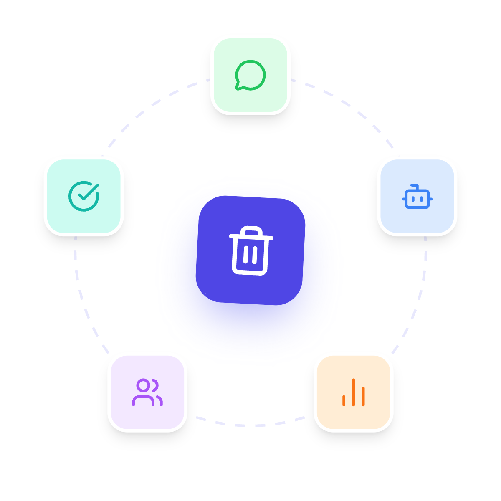
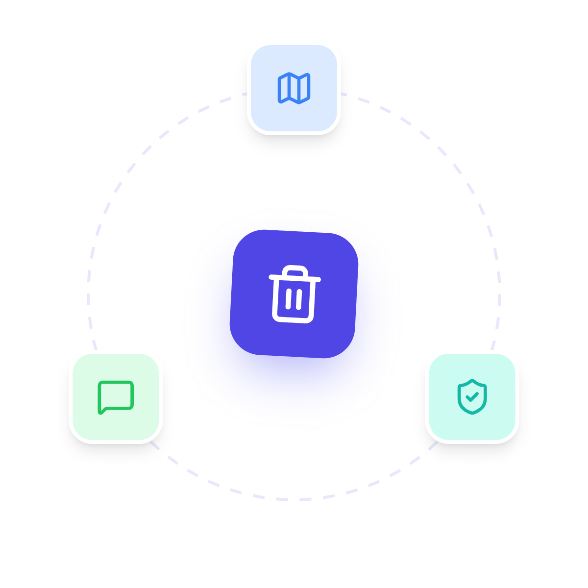
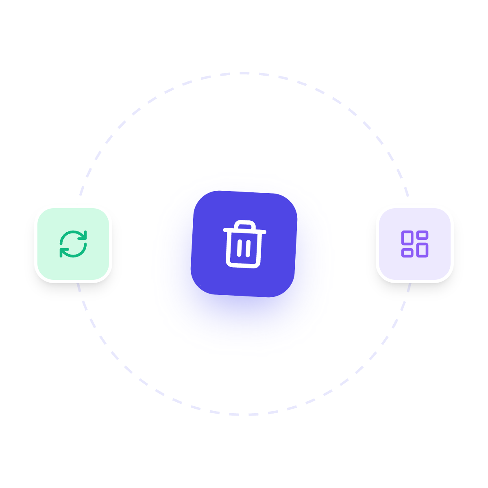
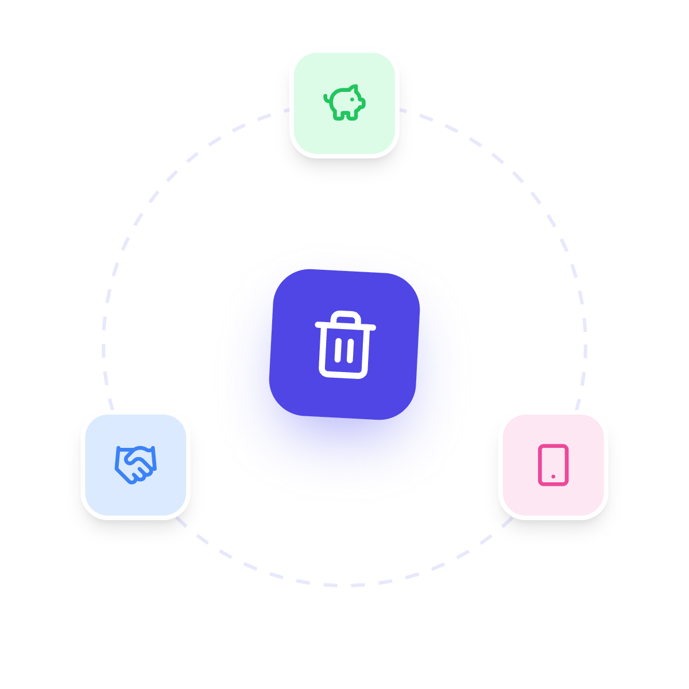
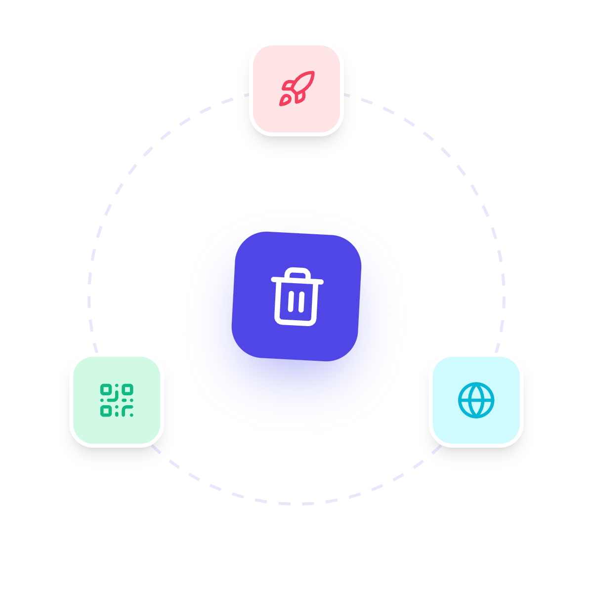

  
  
  # SwachhOS
  **Command Center for a Cleaner City**

  

---

Every great city has a shadow: the quiet accumulation of unauthorized waste. For years, the approach to urban cleanliness has been reactive—citizens complain, authorities eventually dispatch a truck, and the cycle repeats. The data was there, but it was chaotic, siloed, and impossible to act upon efficiently. 

**SwachhOS** is a premium, high-performance geospatial dashboard designed to give city administrators God-mode visibility over urban waste management.

Here is how SwachhOS fundamentally re-engineers the city's cleanliness infrastructure.

---

## 🚨 The Problems We Face

  

* **The Municipal Budget Strain:** Up to **50%** of a city's total revenue budget is swallowed by waste management, and **85%** of that is burned purely on inefficient collection, transport, and fuel, rather than actual waste processing.
* **The True Cost of Illegal Dumping:** Standard landfill disposal costs **$40/ton**, but cleaning up illegal dumping sites costs cities up to **$600/ton** (a 15x cost penalty) and decreases surrounding property values by up to 15%.
* **The Broken Feedback Loop:** Legacy 311 complaint systems have zero accountability, resulting in massive **duplicate reporting** and false hotspots. Ground crews can claim a site is clean when it isn't, and trolls can spam fake reports.

 

---

## 💡 The SwachhOS Solution

  

* **Smart Dispatch (Solves Budget Strain):** AI Priority Zones and Hex Maps deploy teams only where needed, saving massive amounts of fuel and labor. Haversine spatial clustering automatically merges duplicate reports, eliminating redundant truck dispatches.
* **Frictionless Reporting (Solves Illegal Dumping):** A multi-lingual WhatsApp bot lets any citizen report waste in seconds. Crowdsourced reports catch dumping early—before it becomes a massive, $600/ton cleanup.
* **Verified Accountability (Solves the Feedback Loop):** Gemini AI and cryptographic hashing instantly reject fake or duplicate photos before they reach the dashboard. SwachhOS automatically messages reporters to verify and rate a team's cleanup, ensuring 100% accountability.

 

---

## ⚙️ How It Works: The 5-Step Engine

  

1. **WhatsApp Received:** Citizens report illegal dumping simply by sending a photo and location to our multi-lingual WhatsApp bot.
2. **Analysed (AI Validation):** Gemini AI scans the photo to ensure it contains actual garbage, while cryptographic hashing instantly blocks duplicate reports.
3. **Ranking Produced:** Raw reports are spatially clustered on the dashboard map. The system generates live Heatmaps and Hex Grids to rank the most critical zones.
4. **Coordinated Team:** Administrators use the AI Priority Zones to dispatch ground crews precisely where they are needed most.
5. **Feedback (Closing the Loop):** Once cleaned, the system automatically messages the citizen to rate the job. Poor ratings require photo proof, ensuring total accountability.

 

---

## 🚀 Unique Selling Propositions (USP)

  

**1. The Strict "Proof of Work" Feedback Loop**
Traditional systems close the ticket the moment a truck leaves. SwachhOS automatically messages the original reporter on WhatsApp to rate and verify the cleanup. If a citizen maliciously rates a good cleanup poorly (or if a crew fakes a job), the system halts and demands AI-verified photo proof.

**2. The Public Dashboard & Transparency**
We don't just hide data in administrative spreadsheets. SwachhOS translates raw cleanup metrics into live, public leaderboards for different neighborhoods and zones, turning urban cleanliness into a community-driven mission.

 

---

## 🛠️ Under the Hood: Tech Stack

  

* **The Brain & Communication:** Google Gemini 2.5 Flash (AI validation), Firebase (Firestore & Cloud Functions), and Twilio API (WhatsApp integration).
* **The Command Center:** React 18, Vite, and Tailwind CSS for the sleek, glassmorphic UI.
* **The Geospatial Engine:** Leaflet & React-Leaflet, `use-supercluster` (high-speed client-side clustering), and Uber's `h3-js` (hexagonal grid partitioning).

 

---

## 🌍 The Impact

  

* **Massive Financial Savings:** Replaces blind dispatching with AI-driven priority routing.
* **100% Accountability & Trust:** Ensures city funds are only spent on jobs that are genuinely completed and visually verified by the public.
* **Radical Accessibility:** Bypasses app downloads entirely by integrating directly with WhatsApp, featuring full multilingual support.

 

---

  <h2>Try SwachhOS</h2>
  
  
  &nbsp;&nbsp;
  
    
  
  

